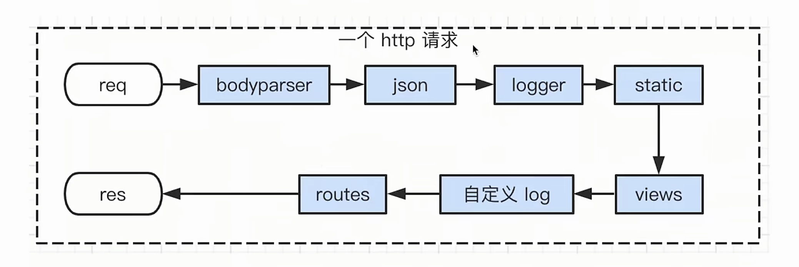
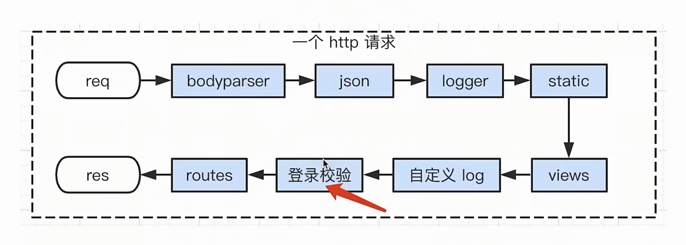
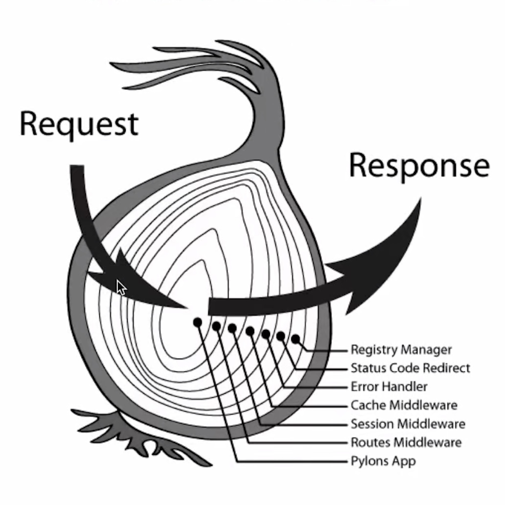
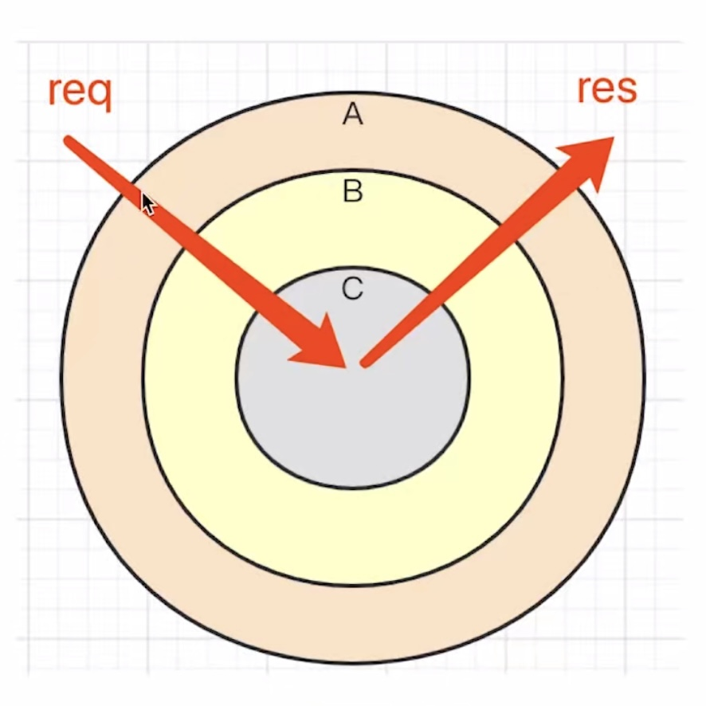

>2021.10.17

# Koa2框架

## 初识koa2 

### koa2 是什么

- 什么是框架？
  - 类比vue
  - 封装原生代码的 API
  - 规范流程和格式
  - 让开发人员更加关注于业务代码，提高开发效率
- 框架frame 和 库lib 的区别
  - 框架是唯一的，库就可以共存
  - 框架关注全流程，库关注单个功能
  - 类比 Vue 和 lodash
- koa2 是 nodejs web server 框架
  - 官网和文档：https://koa.bootcss.com/
  - 通过 async/await 语法高效编写 web server
  - 中间件机制，能合理拆分业务代码

### koa2 的安装和基本使用

- 初始化 npm init
- 安装 npm install koa --save
- koa2初体验

```javascript
const Koa=require('koa')    
const app=new Koa() //创建一个Koa的实例

//ctx context 上下文
app.use(async (ctx)=>{
    ctx.body='htllo world'
})

app.listen(3000) //web server 监听的是 3000 端口
```
- 对比最初的nodejs初体验

```javascript
const http = require('http')

const server = http.createServer((req, res) => {
    res.end('hello world')
})

server.listen(3000)
```

## koa2 环境搭建

- 脚手架
  - 实际项目，不会从0搭建 koa2 环境
  - 使用脚手架 koa-generator 创建 koa2 项目
    - sudo npm install -g koa-generator
    - koa2 --version
    - koa2 文件夹名
    - cd 文件夹名
    - npm install
    - npm run dev
    - localhost:3000
  - 类比 vue-cli
- koa2 项目目录和文件
  - 入口文件 app.js
  - 已安装的 npm插件
  - 各个目录和文件
- 新建路由
  - 新建路由文件
  - 新建路由并exports
  - 引入路由require
  - 注册路由

## koa2 处理 http

- ctx 即 res 和 req 的集合
- querystring 和 Request body
- Response body 和 Content-type

```javascript
const router = require('koa-router')()

router.prefix('/api') //前缀

//定义路由：模拟获取留言板列表
//if(path==='/api/list'&&method==='GET'){
//    res.end('api list')
//}
router.get('/list',async (ctx)=>{
    const query=ctx.query
    console.log('query is: ',query)//获取querystring，req 功能
    //返回的是 字符串格式
    //ctx.body='api list' //res 功能
    //返回的是 json格式
    ctx.body={
        errno: 0,
        data: [
            {content:'留言1',user:'张三'},
            {content:'留言2',user:'李四'},
            {content:'留言3',user:'王五'},
        ]
    }
})

//定义路由：模拟创建留言
router.post('/create',async (ctx)=>{
    const body=ctx.request.body //获取 request body
    console.log('body is: ',body)
    //返回 字符串格式
    //ctx.body='api create'
    //返回 json格式
    ctx.body={
        errno: 0,
        message: '成功'
    }
})

module.exports = router //输出
//需要去app.js中去引用
```

## koa2 中间件

- 什么是中间件
  - 一个流程上，独立的业务模块
  - 可扩展，可插拔
  - 类似于工厂的流水线
- 为何使用中间件？
  - 拆分业务模块，使代码清晰
  - 统一使用中间件，使得各业务代码都规范标准
  - 扩展性好，易添加、易删除
- koa2 业务代码都是中间件
  - 回顾 app.js
  - 所有的 app.use(...) 都是中间件
  - 路由也是中间件（只不过限制了 url 规则）



### 模拟登陆验证功能

- 登陆校验，可使用中间件来实现

```javascript
//模拟登陆（为了使用中间件）
app.use(async (ctx,next)=>{
  const query=ctx.query
  if(query.user==='zhangsan'){
    //模拟登陆成功
    await next() //执行下一步中间件
  }else{
    //模拟登陆失败
    ctx.body='请登录'
  }
})

// routes 注册路由 中间件也可以作为路由来使用
app.use(index.routes(), index.allowedMethods())
app.use(users.routes(), users.allowedMethods())
app.use(comments.routes(),comments.allowedMethods())
```


## koa2 洋葱圈模型

- 中间件机制，是koa2的精髓
- 每个中间件都是async函数
- 中间件的运行机制，就像洋葱圈



简化版：  


- async语法回顾

```javascript
//演示 async await 执行顺序
//（代码要放在浏览器中执行）

//加载一张图片
async function getImg(url = ''){
    await fetch(url)
}

async function fn(){
    const url = 'https://www.apple.com.cn/v/home/hi/images/overview/hero/hero__x15fcac9fw2q_small_2x.jpg'
    const start=Date.now() //记录当前时间
    await getImg(url) //调动，加载图片
    const ms=Date.now()-start //计算时间差
    console.log(`加载图片花费了${ms}毫秒`)
}

//fn()
async function A(){
    console.log('A开始')
    await fn()
    console.log('A结束')
}

//1.A(A)
//2.fn(B)
//3.getImg(C)
//4.fn(B)
//5.A(A)
```

- 洋葱圈模型代码实例

```javascript

//演示 koa2 中间件的洋葱圈模型

//引入koa
const Koa=require('koa')
//初始化koa实例
const app=new Koa()

//logger koa2里：ctx = req + res
//每个中间件使用格式都是一样的
//使用app.use()注册中间件
app.use(async (ctx,next)=>{
    //next就是当前中间件的下一个中间件
    //await next()意思是等待第二个中间件使用结束
    await next() //执行下一个中间件
    //rt=response time
    const rt=ctx.response.get('X-Response-Time')//获取时间差
    console.log(`${ctx.method} ${ctx.url} - ${rt}`)
})

//x-response-time
app.use(async (ctx,next)=>{
    const start=Date.now()
    await next() //执行下一个中间件
    const ms=Date.now()-start //计算时间差
    ctx.set('X-Response-Time',`${ms}ms`)//记录/设置时间差
})

//response
app.use(async (ctx,next)=>{
    ctx.body='Hello world'
})

app.listen(3000)
console.log('koa2 已经开始监听 3000 端口')
---------------------------------------------------------
jaden@sunjuanxiongdeMacBook-Pro koa2-test %node index0.js
koa2 已经开始监听 3000 端口
GET /index.html - 2ms
---------------------------------------------------------
```

- 洋葱圈模型和中间件机制的关系
  - 中间件机制：业务模块的划分
  - 洋葱圈模型：中间件的执行机制

- 小结
  - 中间件机制，是koa2的精髓
  - 每个中间件都是一个async函数
  - 中间件的洋葱圈模型