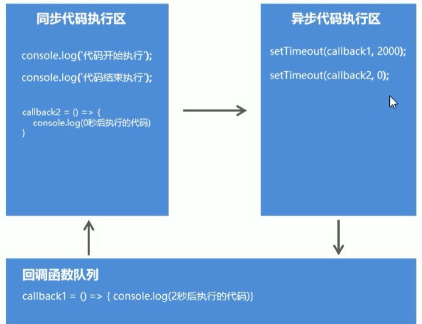

>2021.3.1

# JavaScript异步编程

## Node.js异步编程

### 同步API，异步API

**同步API**：只有当前API执行完成之后，才能继续执行下一个API（sync同步）。   
```javascript
console.log('before');
console.log('after');
---------------------------
before
arter
---------------------------
```   
**异步API**：当前API的执行不会阻塞后续代码的执行（async异步）。
```javascript
console.log('before');
setTimeout(()=>{
    console.log('last');
},2000)
console.log('after');
---------------------------
before
after
last
---------------------------
```
### 同步API，异步API的区别1（获取返回值）
同步API可以从返回值中拿到API执行的结果，但是异步API是不可以的。  
```javascript
//同步
function sum(n1,n2){
    return n1+n2;
}
const result=sum(10,20);
console.log(result);

//异步
function getMsg(){
    setTimeout(() => {
        return {msg:'hello async'}
    },2000);
}
const msg=getMsg();
console.log(msg);
---------------------------
30
undefined
...等待两秒，程序运行结束
---------------------------
```  
### 回调函数
自己定义函数让别人去调用。   
```javascript
//callback是形参，实参实际上是一个函数，将一个函数作为另一个函数的参数
//callback所对应的函数就是回调函数

//getData函数定义
function getData(callback){}
//getData函数调用
getData(()=>{});
```
实例：   
```javascript
function getData(callback) {
    callback(123);
}

getData((n) => {
    console.log('callback函数被调用了');
    console.log(n+5);
})
---------------------------
callback函数被调用了
128
---------------------------
```
异步API中我们不能通过返回值去拿结果，只能通过回调函数callback去取得结果。  
```javascript
function getMsg(callback) {
    setTimeout(() => {
        callback({
            msg: 'hello async'
        })
    }, 2000)
}
getMsg((data) => {
    console.log(data);
})
---------------------------
...等待两秒后
{ msg: 'hello async' }
---------------------------
```
#### 同步API，异步API的区别2（代码执行顺序）
同步API从上到下依次执行，前面代码会阻塞后面代码的执行。  
```javascript
for(var i=0;i<10000000;i++){
    console.log(i);
}
console.log('for循环后面的代码');
```
异步API不会等待API执行完成后再向下执行代码
```javascript
console.log('代码开始执行');
setTimeout(()=>{console.log('2秒后执行的代码')},2000);
setTimeout(()=>{console.log('0秒后执行的代码')},0);
console.log('代码执行结束');
---------------------------
码开始执行
代码执行结束
0秒后执行的代码
2秒后执行的代码
---------------------------
```


### Node.js中的异步API
```javascript
fs.readFile('./demo.txt',(err,result)=>{});
```
```javascript
var server=http.createServer();
server.on('request',(req,res)=>{});
```
**一个问题**：如果异步API后面的代码执行依赖当前异步API的执行结果，但实际上后续代码在执行的时候异步API还没有返回结果，这个问题如何解决？比如：   
```javascript
fs.readFile('./demo.txt',(err,result)=>{});
console.log('文件读取结果');
```
需求：依次读取A文件、B文件、C文件   
#### 回调地狱
```javascript
//回调地狱 callbackhell.js
const fs = require('fs');

fs.readFile('./1.txt', 'utf8', (err, result1) => {
    console.log(result1);
    fs.readFile('./2.txt', 'utf8', (err, result2) => {
        console.log(result2);
        fs.readFile('./3.txt', 'utf8', (err, result3) => {
            console.log(result3);
        })
    })
})
```
#### Promise
Promise出现的目的是解决Node.js异步编程中的回调地狱的问题。  
帮助我们做到异步API的执行和结果处理的一个分离。   
**基础语法**  
```javascript
let promise=new Promise((resolve,reject)=>{
    setTimeout(()=>{
        if(true){
            resolve({name:'张三'})
        }else{
            reject('失败了')
        }
    },2000);
});

promise.then(result=>console.log(result);)//{name:'张三'} 
        .catch(error=>console.log(error);)//失败了
```
- 实际上，promise本身是一个构造函数。如果想用promise去解决回调地狱的问题，我们需要先使用new运算符，去创建promise构造函数的实例对象。  
- 在创建实例对象的过程中，我们需要给构造函数传递一个匿名函数，在匿名函数中它有两个参数，一个是resolve，一个是reject。  
- 原本promise是想我们把异步API的代码，放在这个匿名函数中。比如说，这里的setTimeout,两秒钟的一个定时器，在定时器执行完成之后，那么这个异步API会有一个结果，promise不想让我们在内部再去处理这个结果，它希望我们能把这个拿到外面去处理。如何达到这个目的，我们通过result、reject这两个参数。  
- 第一个project参数，实际上是一个函数。当异步API有返回结果的时候，我们可以去调用resolve这个函数，并且把异步API的执行结果，通过参数的形式把它传出去。简言之，resolve的一个作用是：将异步API的执行结果给它传递出去
- 第二个参数reject，reject本身也是一个函数，当这个异步API执行失败了，我们就可以调用reject这个函数，把这个失败的结果，传递到promise外面去。
- promise实际上，就是在我们原本的异步API的外面，包裹了一层，然后，当我们原本的异步API有返回结果的时候，它给我们提供了两个方法：成功就调用resolve，把结果传递到整体的外面；如果失败就调用reject，把失败的信息传递到整体的外边去，就是这样的一个语法上的改进。   

那么在promise的外面，我们怎样才能拿到这个异步API的执行结果呢？  
注意，我们在new Promise()以后,我们得到了一个promise的实例对象，在promise这个实例对象下面我们有一个then方法，then有然后的意思，在then方法里面我们要传递一个函数，当异步API执行完成的时候，我们调用resolve这个参数，那么调用resolve实际是执行then里面的回调函数，这是获取成功里的结果。如果失败了，我们调用了reject，promise下我们除了then方法以外，还给我们提供了一个catch方法，catch方法里面也需要传递一个函数，我们调用reject实际上调用的就是catch这个方法内部的这个函数。我们在这个函数里面就能拿到失败的信息了。promise允许链式编程，在`.then`后面再有一个`.catch`。    

我们把异步API的执行和结果实现了一个分离：   
```javascript
const fs = require('fs');
const { resourceLimits } = require('worker_threads');
let promise = new Promise((resolve, reject) => {
    fs.readFile('./1.txt', 'utf8', (err, result) => {
        if (err != null) {
            reject(err)
        } else {
            resolve(result);
        }
    });
});

promise.then((result) => {
    console.log(result);
}).catch((err) => {
    console.log(err);
})
```
那么如何用promise来解决回调地狱的问题呢？  
如果我们想用promise去解决回调地狱的问题，首先我们要看，这个回调地狱中有多少个异步API，有三个异步API，我们就需要三个promise对象。我们在第一个promise对象里去读取第一个文件，以此类推。   
```javascript
//promise解决回调地狱 promise.js
const fs = require('fs');

/* fs.readFile('./1.txt', 'utf8', (err, result1) => {
    console.log(result1);
    fs.readFile('./2.txt', 'utf8', (err, result2) => {
        console.log(result2);
        fs.readFile('./3.txt', 'utf8', (err, result3) => {
            console.log(result3);
        })
    })
}) */

function p1() {
    //let p1 = new Promise((resolve, reject) => {
    return new Promise((resolve, reject) => {
        fs.readFile('./1.txt', 'utf8', (err, result) => {
            resolve(result);
        })
    })
}

function p2() {
    return new Promise((resolve, reject) => {
        fs.readFile('./2.txt', 'utf8', (err, result) => {
            resolve(result);
        })
    })
}

function p3() {
    return new Promise((resolve, reject) => {
        fs.readFile('./3.txt', 'utf8', (err, result) => {
            resolve(result);
        })
    })
}

p1().then((r1) => {
    console.log(r1);
    return p2();
}).then((r2) => {
    console.log(r2);
    return p3();
}).then((r3) => {
    console.log(r3);
    return p3();
})
```

#### 异步函数
**异步函数**是异步编程语法的终极解决方案，它可以让我们将异步代码写成同步的形式，让代码不再有回调函数嵌套，使代码变得清晰明了。    
**异步函数基础语法**： 
```javascript
const fn=async()=>{};
```
```javascript
async function fn(){};
```
所谓异步函数，就是在普通函数定义的前面加上关键字，async这个关键字实际上就是异步的意思，加上async这个关键字之后，普通函数就变成了异步函数。  

**实例**：   
```javascript
//asyncFunction.js

async function fn() {
    //return new Promise();
    throw '发生了一些错误';
    return 123;
    //我们现在使用了return这个关键字替代了原有的resolve方法
}

//console.log(fn());
fn().then(function(data) {
    console.log(data);
}).catch(function(err) {
    console.log(err);
})
```
**async关键字**  
1. 普通函数定义的前面加上`async关键字`，普通函数就变成了异步函数
2. 异步函数默认的返回值是`promise对象`
3. 在异步函数内部我们使用`return关键字`进行结果返回，结果会包裹在promise对象中，我们使用return关键字代替了resolve方法
4. 在异步函数内部我们可以使用`throw关键字`抛出程序异常
5. 在异步函数外面`链式调用then方法`可以获取异步函数执行结果
6. 在异步函数外面`链式调用catch方法`可以获取异步函数执行的错误信息

**await关键字**   
1. await关键字只能出现在异步函数中
2. `await promise`：await后面只能写promise对象，写其他类型的API不可以
3. await关键字可以暂停异步函数向下执行，直到promise返回结果

```javascript
async function p1() {
    return 'p1';
}
async function p2() {
    return 'p2';
}
async function p3() {
    return 'p3';
}
//异步操作写成了同步代码的格式
async function run() {
    let r1 = await p1();
    let r2 = await p2();
    let r3 = await p3();
    console.log(r1);
    console.log(r2);
    console.log(r3);
}
run();
```

**使用异步函数解决依次读取A、B、C三个文件**
```javascript
const fs = require('fs');
//改变现有异步函数api，让其返回promise对象，从而支持异步函数语法
const promisify = require('util').promisify;
//调用promisify方法改造现有异步api，让其返回promise对象
const readFile = promisify(fs.readFile);

async function run() {
    let r1 = await readFile('./1.txt', 'utf8');
    let r2 = await readFile('./2.txt', 'utf8');
    let r3 = await readFile('./3.txt', 'utf8');
    console.log(r1);
    console.log(r2);
    console.log(r3);
}
run();
```
