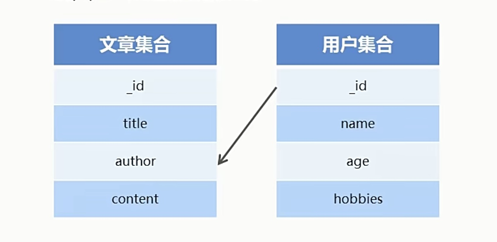

>2021.3.5

# MongoDB数据库

## 数据库概述及环境搭建

### 为什么要使用数据库
- 动态网站中的数据都是存储在数据库中的
- 数据库可以用来持久存储客户端通过表单收集的用户信息
- 数据库软件本身可以对数据进行高效的管理

### 什么是数据库
数据库即存储数据的仓库，可以将数据进行有序的分门别类的存储。它是独立于语言之外的软件，可以通过API去操作它。     


常见的数据库软件有：mysql、mongoDB、oracle。     

### MongoDB数据库下载安装
下载地址：  
- MongoDB数据库软件：https://www.mongodb.com/try/download/community
- MongoDB可视化操作软件compass：https://www.mongodb.com/try/download/compass

  

Mac安装：   
- 安装 homebrew
  - https://brew.sh/
  - /bin/bash -c "$(curl -fsSL https://raw.githubusercontent.com/Homebrew/install/HEAD/install.sh)"
- brew 切换源
  - 替换brew.git
    - cd "$(brew --repo)"
    - git remote set-url origin https://mirrors.tuna.tsinghua.edu.cn/git/homebrew/brew.git
  - 替换homebrew-core.git
    - cd "$(brew --repo)/Library/Taps/homebrew/homebrew-core"
    - git remote set-url origin https://mirrors.tuna.tsinghua.edu.cn/git/homebrew/homebrew-core.git
  - 刷新源
    - brew update
- 安装 mongodb
  - https://github.com/mongodb/homebrew-brew
  - brew install mongodb-community
- Run/Stop mongod as a service
  - brew services start mongodb-community
    - mongo
    - 1+1 回车
  - brew services stop mongodb-community


### 数据库相关概念 
在一个数据库软件中，可以包含多个数据仓库，在每个数据仓库中可以包含多个数据集合，每个数据集合中包含多条文档（具体的数据）。   

一些相关术语：
- database：数据库，mongoDB数据库软件中可以建立多个数据库
- collection：集合，一组数据的集合，可以理解为JavaScript中的数组
- document：文档，一条具体的数据，可以理解为JavaScript中的对象
- field：字段，文档中的属性名称，可以理解为JavaScript中的对象属性

### Mongoose第三方包
- 使用Node.js操作MongoDB数据库需要依赖Node.js第三方包mongoose
- 使用`npm install mongoose`命令下载

### 启动MongoDB

- windows   
  在命令行工具中运行`net start mongoDB`即可启动MongoDB，否则MongoDB将无法连接。（`net stop mongodb`停止MongoDB服务）。   
- mac
  - brew services start mongodb-community
  - brew services stop mongodb-community  

### 数据库连接

使用mongoose提供的**connect**方法即可连接数据库。    
```javascript
const mongoose=require('mongoose');
//前面的mongodb是一个协议，后面的playground是数据库名
//mongoose返回的是一个promise对象，我们就可以.then、.catch
mongoose.connect('mongodb://localhost/playground')
    .then(()=>console.log('数据库连接成功'))
    .catch(err=>console.log('数据库连接失败',err));
```

### 创建数据库

在MongoDB中**不需要显示创建数据库**，如果正在使用的数据库不存在，**MongoDB会自动创建**。   

## MongoDB增删改查操作

### 创建集合
创建集合分为两步，一是**对集合设定规则**，二是**创建集合**，创建mongoose.Schema构造函数的实例即可创建集合。     
- Schema：模式、规则
- 对集合设定规则：规定在这个集合的文档要拥有哪些字段，字段的类型是什么···

```javascript
//创建集合规则
//创建规则实际上就是创建Schema的实例对象
const courseSchema = new mongoose.Schema({
    name:String,
    author:String,
    isPublished:Boolean
});
//使用规则创建集合
//第一个参数是集合的名称，规定首字母大写
//第二个参数是为集合应用的规则
//model方法有返回值，返回值就是这个集合的一个构造函数,构造函数下面有很多方法
const Course=mongoose.model('Course',courseSchema);//courses
//Course是当前集合的构造函数
//为什么返回构造函数？
//因为这个构造函数下面有很多方法，让我们可以对这个集合进行操作
```

### 创建文档
创建文档实际上就是**向集合中插入数据**。分为两步：   
- 创建集合实例
- 调用实例对象下的sava方法将数据保存到数据库中

#### 通过回调函数方式返回结果
```javascript
//创建集合实例（文档）
//Course构造函数实例化之后会返回一个对象
const course=new Course({
    name:'Node.js基础',
    author:'Jaden',
    isPublished:true
});
//将数据保存到数据库中（将文档插入数据库中）
course.save();
```
另一种创建文档的方法：   
```javascript
Course.create({
    name:'JavaScript基础',
    author:'Jaden',
    isPublish:true
},(err,doc)=>{
    //错误对象
    console.log(err);
    //当前插入的文档
    console.log(doc);
});
```
第二个参数是一个回调函数，说明，这是一个异步API。实际上，关于数据库的所有操作都是异步操作，因为他们都需要处理时间。而也因为如此，他们也都支持通过promise的方式获取返回的结果。  

#### 通过promise对象方式返回结果
```javascript
Course.create({
    name:'JavaScript基础',
    author:'黑马讲师',
    isPublish:true
}).then(doc=>{console.log(doc)})
    .catch(err=>{console.log(err)});
```

### mongoDB数据库导入数据

导入命令：`mongoimport -d 数据名称 -c 集合名称 --file 要导入的数据文件`       

> 在之前，要先下载mongodb tools，然后找到mongoimport的安装目录，将安装目录下的bin目录放到环境变量中。  

```shell
jaden@sunjuanxiongdeMacBook-Pro database-test %mongoimport -d playground -c users --file ./user.json
2021-10-27T08:24:36.746+0800    connected to: mongodb://localhost/
2021-10-27T08:24:36.873+0800    6 document(s) imported successfully. 0 document(s) failed to import.
```

## 查询文档

```javascript
//根据条件查找文档（条件为空则查找所有文档）
Course.find().then(result=>console.log(result));
//通过字段查找文档
Course.find({author:'黑马'}).then(result=>console.log(result));
//返回文档集合(一个数组)
[{
    _id:xxxxxxxxxxxxxxxxxxxxxxx,
    name:'node',
    author:'黑马'
},{
    _id:xxxxxxxxxxxxxxxxxxxxxxx,
    name:'javascript',
    author:'黑马'
}]
```
find()方法返回promise对象。     

另一种方式查找文档： 
```javascript
Course.findOne({name:'node.js基础'}).then(result=>console.log(result))
//findOne()返回的是一个对象，不是一个数组  
{
    _id:xxxxxxxxxxxxxxxxxxxxxxx,
    name:'node.js基础',
    author:'黑马'
}
```

范围查找：
```javascript
//匹配大于 小于
User.find({age: {$gt: 20,$lt: 50}}).then(result => console.log(result))
```
```javascript
//匹配包含
User.find({hobbies: {$in: ['敲代码']}}).then(result=>console.log(result))
```
```javascript
//选择要查询的字段
User.find().select('name email -_id').then(result=>console.log(result))
```
```javascript
//将数据按照年龄进行升序排序
User.find().sort('age').then(result=>console.log(result));
//将数据按照年龄进行降序排序
User.find().sort('-age').then(result=>console.log(result));
```
```javascript
//skip跳过多少条数据 limit限制查询数量
User.find().skip(2).limit(2).then(result=>console.log(result));
```

## 删除文档

- 删除单个 findOneAndDelete()
```javascript
//查找到一条文档并且删除
//返回删除的文档
//如果查询条件匹配了多个文档，那么将会删除第一个匹配的文档
User.findOneAndDelete({name:'王五'})
    .then(res=>{
        console.log(res)
    })
```
- 删除多个 deleteMany()
```javascript
//删除多条文档
//返回一个对象，{ deletedCount: 5 }
User.deleteMany({}).then(res=>console.log(res))
```

## 更新文档

- 更新单个 updateOne()
```javascript
User.updateOne({查询条件},{要修改的值}).then(res=>console.log(res))
```
- 更新多个 updateMany()
```javascript
User.updateMany({查询条件},{要修改的值}).then(res=>console.log(res))
```

## mongoose验证

在创建集合规则时，可以设置当前字段的验证规则，验证失败则插入失败。
- required: true 必传字段
- minlength: 3 字符串最小长度
- maxlength: 20 字符串最大长度
- min: 2 数值最小为2
- max: 100 数值最大为100
- enum: ['html','css','js']
- trim: true 去除字符串两边的空格
- validate: 自定义验证器
- default: 默认值

```javascript
const postSchema=new mongoose.Schema({
    //title: String,
    title:{
        type: String,
        //设置验证规则
        //必选字段
        required:[true,'请传入文章标题'],
        //字符串长度限制
        minlength:[2,'标题长度不能小于2'],
        maxlength:5,
        //是否去除空格
        trim:true 
    },
    age:{
        type:Number,
        //数字的范围限制
        min:18,
        max:100
    },
    publishDate:{
        type:Date,
        //默认值
        default:Date.now
    },
    category:{
        type:String,
        //枚举，列举出当前字段可以拥有的值
        enum:{
            values: ['html','css','javascript'],
            message: '分类名称要在一定的范围类'
        }
    },
    author:{
        type:String,
        validate:{
            //validator属性是一个函数类型
            //有一个参数，是用户插入的值
            validator:val=>{
                //返回一个布尔值
                //true 验证成功
                //false 验证失败
                //val 要验证的值
                return val&&val.length>4
            },
            //自定义错误信息
            message:'传入的值不符合验证规则'
        }
    }
})
const Post=mongoose.model('Post',postSchema)

Post.create({
    title:'aaa',
    age:39,
    category:'html0',
    author: 'bd'
}).then(res=>console.log(res))
  .catch(error=>{
    //console.log(err,'创建失败')
    //获取错误信息对象
    const err=error.errors;
    //循环信息对象
    for(var attr in err){
      //将错误信息打印到控制台中
      console.log(err[attr]['message'])
    }
  })
```

## 集合关联

通常**不同集合的数据之间是有关系的**，例如文章信息和用户信息存储在不同集合中，但文章是某个用户发表的，要查询文章的所有信息包括发表用户，就需要用到集合关联。

集合关联步骤：
- 使用id对集合进行关联
- 使用populate方法进行关联集合查询



```javascript
const mongoose=require('mongoose')
mongoose.connect('mongodb://localhost/playground')
    .then(()=>console.log('数据库连接成功'))
    .catch(err=>console.log('数据库连接失败'));

//用户集合规则
const userSchema=new mongoose.Schema({
    name:{
        type: String,
        required: true
    }
});

//文章集合规则
const postSchema=new mongoose.Schema({
    title:{
        type: String
    },
    author:{
        type: mongoose.Schema.Types.ObjectId,
        ref: 'User'
    }
})

//创建用户集合
const User=mongoose.model('User',userSchema);
//创建文章集合
const Post=mongoose.model('Post',postSchema);

//创建用户
User.create({
    name: 'Jaden'
}).then(
    result=>console.log(result)
)
//创建文章
Post.create({
    title: '123',
    author: '617cbd7d707e57e746fabc30'
}).then(
    result=>console.log(result)
)

//查询
Post.find({title: '123'}).populate('author')
    .then(res=>console.log(res))
```

## 案例：用户信息的增删改查

步骤：
1. 搭建网站服务器，实现客户端与服务器端的通信
2. 连接数据库，创建用户集合，向集合中插入文档
3. 当用户访问`/list`时，将所有用户信息查询出来
   - 实现路由功能
   - 呈现用户列表页面
   - 从数据库中查询用户信息，将用户信息展示在列表中
4. 将用户信息和表格HTML进行拼接并将拼接结果响应回客户端
5. 当用户访问`/add`时，呈现表单页面，并实现添加用户信息功能
   - 接收用户提交的信息
   - 将用户提交的信息添加到数据库
6. 当用户访问`/modify`时，呈现修改页面，并实现修改用户信息功能
   - 增加页面路由 呈现页面
     - 在点击修改按钮的时候，将用户ID传递到当前页面
     - 在数据库中查询当前用户信息，将用户信息展示到页面中
   - 实现用户修改功能
     - 指定表单的提交地址以及请求方式
     - 接受客户端传递过来的修改信息，找到用户，将用户信息更改为最新的用户信息
7. 当用户访问`/delete`时，实现用户删除功能

```javascript
//user/app.js

const http=require('http');
const mongoose=require('mongoose');
const url=require('url');
const querystring=require('querystring');

//数据库连接 localhost:27017是mangodb的默认端口，可以省略不写
mongoose.connect('mongodb://localhost/playground')
    .then(()=>console.log('数据库连接成功了'))
    .catch(err=>console.log(err,'数据库连接失败了'));

//创建用户集合规则
const userSchema=new mongoose.Schema({
    name:{
        type: String,
        required: true,
        minlength: 2,
        maxlength: 20
    },
    age:{
        type: Number,
        min: 18,
        max: 80
    },
    password: String,
    email: String,
    hobbies: [String]
})

//使用集合规则创建集合 返回集合的构造函数
const User=mongoose.model('User',userSchema);


//创建服务器
const app=http.createServer();

//为服务器对象添加请求事件 使其成为异步函数
app.on('request',async (req,res)=>{
    //获取请求方式
    const method=req.method;
    //解构出请求地址
    const {pathname,query}=url.parse(req.url,true);

    //判断请求方式
    if(method=='GET'){
        //get方式，一般都是数据的请求 或者 是页面的成立
        //根据请求地址作进一步判断
        if(pathname=='/list'){
            //查询用户信息 返回一个数组
            let users=await User.find();
            //console.log(users);
            //呈现用户列表页面 （html字符串）
            //html头部
            let list=`
            <!DOCTYPE html>
            <html lang="en">
            <head>
                <meta charset="UTF-8">
                <meta http-equiv="X-UA-Compatible" content="IE=edge">
                <meta name="viewport" content="width=device-width, initial-scale=1.0">
                <title>用户列表</title>
                <link rel="stylesheet" href="https://cdn.jsdelivr.net/npm/bootstrap@3.3.7/dist/css/bootstrap.min.css">
            </head>
            <body>
                <div class="container">
                    <h6>
                        <a href="/add" class="btn btn-primary">添加用户</a> 
                    </h6>
                    <table class="table table-striped table-bordered">
                        <tr>
                            <td>用户名</td> 
                            <td>年龄</td>   
                            <td>爱好</td>
                            <td>邮箱</td>   
                            <td>操作</td>
                        </tr>
            `;

            //对数据进行循环操作
            users.forEach(item=>{
                list+=`
                <tr>
                <td>${item.name}</td>
                <td>${item.age}</td>
                <td>`;

                item.hobbies.forEach(item=>{
                    list+=`<span>${item} </sapn>`
                })

                list+=`</td>
                <td>${item.email}</td>
                <td>
                    <a href="/remove?id=${item._id}" class="btn btn-danger btn-xs">删除</a>
                    <a href="/modify?id=${item._id}" class="btn btn-success btn-xs">修改</a>
                </td>
                `;
            })

            //html尾部
            list+=`
                    </table>
                </div>
                </body>
            </html>
            `
            res.end(list);
        }
        if(pathname=='/add'){
            //呈现增加用户表单界面
            let add=`
            <!DOCTYPE html>
            <html lang="en">
            <head>
                <meta charset="UTF-8">
                <meta http-equiv="X-UA-Compatible" content="IE=edge">
                <meta name="viewport" content="width=device-width, initial-scale=1.0">
                <title>用户列表</title>
                <link rel="stylesheet" href="https://cdn.jsdelivr.net/npm/bootstrap@3.3.7/dist/css/bootstrap.min.css">
            </head>
            <body>
                <div class="container">
                    <h3>添加用户</h3>   
                    <form method="post" action="/add">
                        <div class="form-group">
                            <label>用户名</label>       
                            <input name="name" type="text" class="form-control" placeholder="请填写用户名">
                        </div>
                        <div class="form-group">
                            <label>密码</label>
                            <input name="password" type="password" class="form-control" placeholder="请输入密码">           
                        </div>
                        <div class="form-group">
                            <label>年龄</label>
                            <input name="age" type="text" class="form-control" placeholder="请填写年龄">
                        </div>
                        <div class="form-group">
                            <label>邮箱</label>
                            <input name="email" type="email" class="form-control" placeholder="请填写邮箱">
                        </div>
                        <div class="form-group">
                            <label>请选择爱好</label>
                            <div>
                                <label class="checkbox-inline">
                                    <input type="checkbox" value="足球" name="hobbies"> 足球
                                </label>
                                <label class="checkbox-inline">
                                    <input type="checkbox" value="篮球" name="hobbies"> 篮球
                                </label>
                                <label class="checkbox-inline">
                                    <input type="checkbox" value="棒球" name="hobbies"> 棒球
                                </label>
                                <label class="checkbox-inline">
                                    <input type="checkbox" value="喝酒" name="hobbies"> 喝酒
                                </label>
                                <label class="checkbox-inline">
                                    <input type="checkbox" value="游泳" name="hobbies"> 游泳
                                </label>
                            </div>
                        </div>
                        <button type="submit" class="btn btn-primary">添加用户</button>
                    </form>
                </div>
            </body>
            </html>
            `;
            res.end(add);
        }
        if(pathname=='/modify'){
            //根据query携带的id去数据库中查找
            let user=await User.findOne({_id:query.id});
            //console.log(user);
            let hobbies=['足球','篮球','棒球','喝酒','游泳'];
            //呈现修改用户表单界面
            let modify=`
            <!DOCTYPE html>
            <html lang="en">
            <head>
                <meta charset="UTF-8">
                <meta http-equiv="X-UA-Compatible" content="IE=edge">
                <meta name="viewport" content="width=device-width, initial-scale=1.0">
                <title>用户列表</title>
                <link rel="stylesheet" href="https://cdn.jsdelivr.net/npm/bootstrap@3.3.7/dist/css/bootstrap.min.css">
            </head>
            <body>
                <div class="container">
                    <h3>修改用户</h3>   
                    <form method="post" action="/modify?id=${user._id}">
                        <div class="form-group">
                            <label>用户名</label>       
                            <input value=${user.name} name="name" type="text" class="form-control" placeholder="请填写用户名">
                        </div>
                        <div class="form-group">
                            <label>密码</label>
                            <input value=${user.passwdord} name="password" type="password" class="form-control" placeholder="请输入密码">           
                        </div>
                        <div class="form-group">
                            <label>年龄</label>
                            <input value=${user.age} name="age" type="text" class="form-control" placeholder="请填写年龄">
                        </div>
                        <div class="form-group">
                            <label>邮箱</label>
                            <input value=${user.email} name="email" type="email" class="form-control" placeholder="请填写邮箱">
                        </div>
                        <div class="form-group">
                            <label>请选择爱好</label>
                            <div>
                        `;
            hobbies.forEach(item=>{
                //判断当前循环项是否在用户的爱好数组中
                let isHobby=user.hobbies.includes(item);
                if(isHobby){
                    modify+=`
                        <label class="checkbox-inline">
                            <input type="checkbox" value="${item}" name="hobbies" checked> ${item}
                        </label>
                    `
                }else{
                    modify+=`
                        <label class="checkbox-inline">
                            <input type="checkbox" value="${item}" name="hobbies"> ${item}
                        </label>
                    `
                }
            })
            
            //修改界面后半段
            modify+=`       </div>
                        </div>
                        <button type="submit" class="btn btn-primary">修改信息</button>
                    </form>
                </div>
            </body>
            </html>
            `;
            res.end(modify);
        }
        if(pathname=='/remove'){
            //res.end(query.id);
            await User.findOneAndDelete({_id:query.id});
            res.writeHead(301,{
                Location:'/list'
            });
            res.end();//结束掉此次请求
        }
    }
    if(method=='POST'){
        //post方式，一般都是实现一些功能，比如 添加数据、修改数据
        //用户添加功能
        if(pathname=='/add'){
            //添加在form表单的action属性中，action="/add"
            //准备一个变量 用来拼接post参数
            let formData='';
            //前台当有数据发生传递的时候，就会触发data事件
            //接收post参数
            req.on('data',param =>{
                formData+=param;
            })
            //当参数接收完毕后，会触发end事件
            //post参数接收完毕
            req.on('end',async ()=>{
                //console.log(querystring.parse(formData));
                //将用户提交的信息添加到数据库当中
                let user=querystring.parse(formData);
                //加上await使其变成同步形式
                await User.create(user);
                //通过writeHead()方法对他进行重定向
                //301代表重定向
                //location代表跳转地址
                res.writeHead(301,{
                    Location: '/list'
                });
                //重定向完之后一定要调用res.end()
                res.end();
            })
            //console.log('123');
        }
        if(pathname=='/modify'){
            //添加在form表单的action属性中，action="/modify"
            //准备一个变量 用来拼接post参数
            let formData='';
            //前台当有数据发生传递的时候，就会触发data事件
            //接收post参数
            req.on('data',param =>{
                formData+=param;
            })
            //当参数接收完毕后，会触发end事件
            //post参数接收完毕
            req.on('end',async ()=>{
                //console.log(querystring.parse(formData));
                //将用户提交的信息添加到数据库当中
                let user=querystring.parse(formData);
                //加上await使其变成同步形式
                await User.updateOne({_id:query.id},user);
                //通过writeHead()方法对他进行重定向
                //301代表重定向
                //location代表跳转地址
                res.writeHead(301,{
                    Location: '/list'
                });
                //重定向完之后一定要调用res.end()
                res.end();
            })
        }

    }
    //res.end('ok');
    })
//监听3000端口
app.listen(3000);
```
代码写完了上述功能实现了，但是有两个问题
- 所有的代码都写在了一个文件中->我们应该采用模块化开发方式
- 我们有大量的字符串拼接->模版引擎


