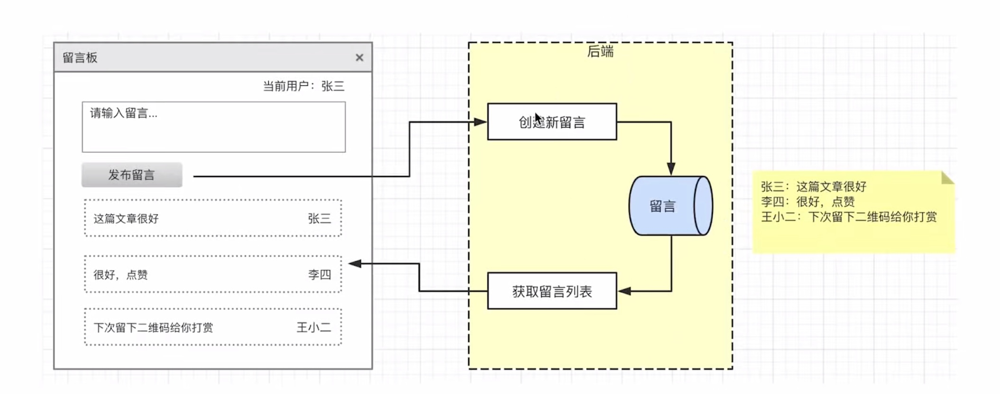
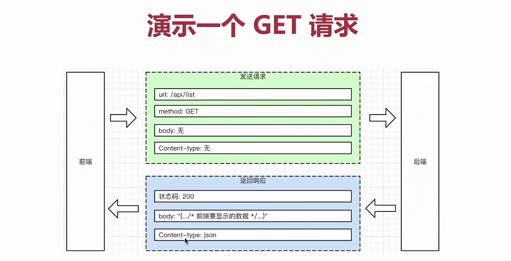
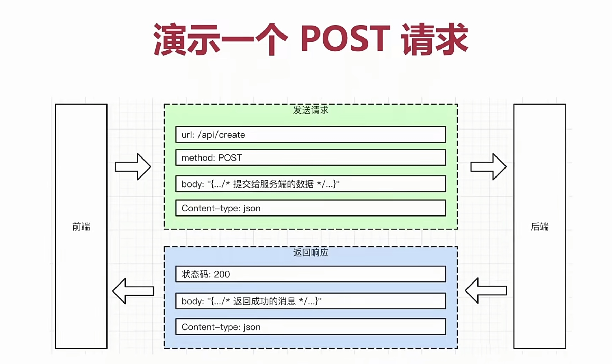
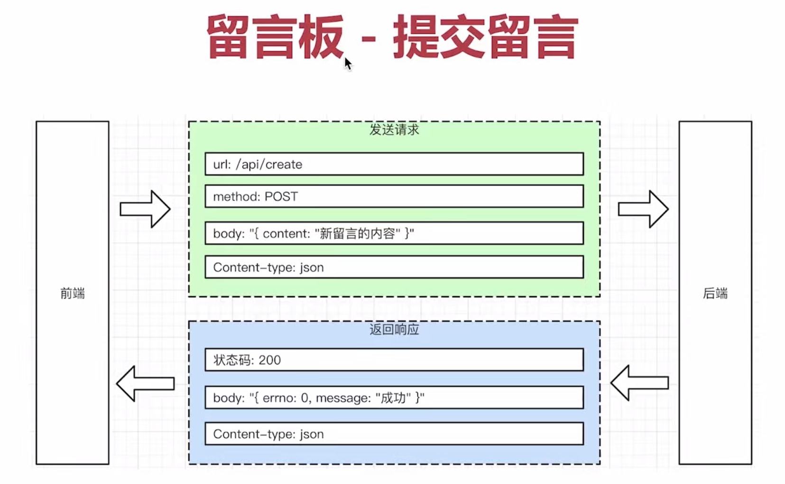
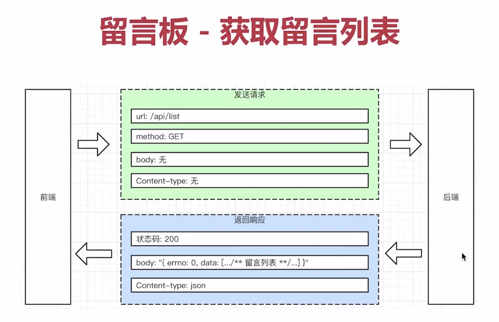
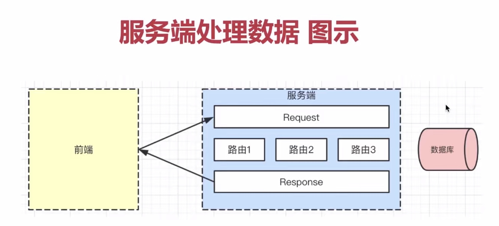

>2021.10.16

# 前端、服务端概述

## 什么是服务端

### 什么是服务端

- 服务端，又称后端、server端
- 前端是用户可见、可操作的部分
- 服务端为前端提供支撑

### 服务端的职责和功能

- 提供前端要展示的数据
- 接收前端要提交的数据
- 存储数据

### 服务端的表现形式

- 前端 ajax 要调用某个接口，这个接口就是服务端提供的，这就是服务端的表现形式之一
- 如：get请求获取数据，post请求提交数据等

### 应用

留言板系统  
- 开发过程
  - 开发前端页面，如用 Vue
  - 需要 Ajax 的接口：获取留言列表，提交留言
  - 开发服务端，提供接口：创建新留言，获取留言列表   
 


## 前端和服务端的交互

### 回顾 http协议

- 简介
  - http：超文本传输协议 HyperText Transfer Protocol
  - 规定了客户端和服务端如何通讯
  - 是互联网世界数据通讯的标准和基石
- http协议 - 通用
  - url：后端接口的地址，即前端 Ajax 请求时的地址
  - method：请求方法，如 GET、POST、PUT、DELETE 等
  - http code：状态码，即接口返回的状态，如 200、302、404、500 等
- http协议 - Request
  - Request：请求
  - Request Body：请求是发送给后端的数据
  - Request Content-type：发送数据的格式，如 json等
- http协议 - Response
  - Response：返回/响应
  - Response Body：后端返回给前端的数据
  - Response Content-type：返回数据的格式，如 json等





### 留言板示例
\




- 返回格式
  - errno: 0（即 error number 简写）
  - data: {...}
  - message: "..."

### 一个网页需要加载的资源

- 常见需要加载的资源有
  - html
  - css
  - js
  - 图片
  - 视频（如有）
  - 数据
- 不同资源可能来自不同的域名
  - html可能来自一个单独的域名
  - js、css可能来自一个独立的域名
  - 数据可能来自一个独立的域名
- 即，一个前端页面对应不同的服务端，通常分为两类
  - 静态服务
  - 数据服务
- nodejs关注如何提供数据服务

### 服务端如何处理数据

- 定义前端请求的 url规则 —— **路由**
  - 前端 Ajax 需要url
  ```javascript
  function getUserAccount(){
      return axios.get('/user/12345');
  }

  function getUserPermissions(){
      return axios.get('/user/12345/permissions');
  }
  ```
- 路由是什么
  - router
  - 服务端的入口规则（规定url怎么写）
- 路由包含什么
  - 定义 method，如 GET/POST 等
  - 定义 url 规则，如 /api/list 和 /api/create
  - 定义输入（Request body）和输出（Response body）格式
- 路由和url
  - GET /api/list 路由 -> axios.get('/api/list?a=1')
  - POST /api/create 路由 -> axios.get('/api/create',{...})
  - 路由是规则，url是具体的形式
- 用 Request 获取数据，用 Response 返回数据
  - 也可简称 req 和 res
  - 通过 Request 可获取：method、url、body
  - 通过 Response 可设置：http code、Content-type、body
  - 服务端拥有 Request 和 Response 即可做任何事
- 路由规则的实现离不开 Request
  - 先定义路由规则（method、url规则）
  - 通过 Request 可获取：method、url
  - 检查 method 和 url 是否符合哪个路由
- 读取和存储数据 - 数据库
  - 数据库，负责数据的存储和查询
  - 数据库的基本操作 - 增/删/改/查/排序



## nodejs的优势

### 不同语言都能实现服务端职责

- 处理 http 请求（Request、Response）
- 定义路由，供前端 Ajax 访问
- 使用数据库，存储和查询数据

### 不同语言有哪些不同

- 语言语法和内置Api
- 框架
- 工具包和软件包（如nodejs是npm）

### 初学服务端的重点

- 掌握服务端开发的流程和套路
- 能快速做出项目，在实践中进步
- 不应该被语言、语法喧宾夺主

### nodejs对于前端工程师的优势

- nodejs使用JS语法
- nodejs使用npm
- 还需要学习框架和API
- nodejs已经被普及使用

## 如何学习nodejs

### nodejs学习范围

- nodejs基础知识，使用 npm，处理 http请求
- koa2框架
- mongodb数据库

### 文档

- nodejs: nodejs.cn
- koa2: koa.bootcss.com

