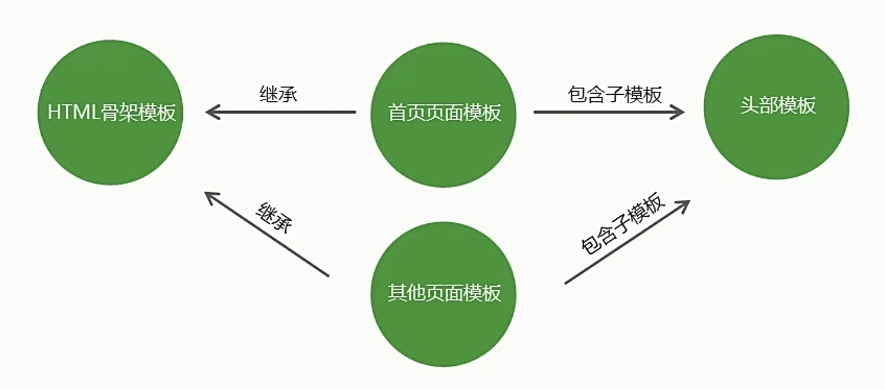

>2021.10.30

# 模版引擎

## 模版引擎的基础概念
模版引擎是第三方模块。   
让开发者以更友好的方式拼接字符串，使项目代码更加清晰、更加易于维护。
```javascript
//未用模版引擎的写法
var ary=[{
    name: 'lily',
    age: 20
}];
var str='<ul>';
for(var i=0;i<ary.length;i++){
    str+=
    '<li>\
        <span>'+ary[i].name+'</span>\
        <span>'+ary[i].age+'</span>\
    </li>';
}
str+='</ul>';
```
```html
<!-- 使用模版引擎的写法 -->
<ul>
    {{each ary}}
        <li>{{$value.name}}</li>
        <li>{{$value.age}}</li>
    {{/each}}
</ul>
```

## art-template模版引擎

- 在命令行工具中使用 `npm install art-template` 命令进行下载
- 使用 `const template = require('art-template')` 引入模版引擎
- 告诉模版引擎要拼接的数据和模版在哪 `const html = template('模版路径',数据);`

```javascript
//导入模版引擎
const template=require('art-template');
const path=require('path');//有join方法，可以拼接路径

//template方法是用来拼接字符串的
//  - 第一个参数：模版路径（绝对路径）
//  - 第二个参数：要在模版中显示的数据，是对象类型
//  - return：template方法返回拼接好的字符串
const viewsPath=path.join(__dirname,'views','index.art');
const html=template(viewsPath,{
    name: 'lily',
    age: 20
});
console.log(html);
```
```html
<!-- 模版 index.art 中的代码 -->
<!DOCTYPE html>
<html lang="en">
<head>
    <meta charset="UTF-8">
    <title>用户列表</title>
</head>
<body>
    {{name}}
    {{age}}
</body>
</html>
```

## 模版引擎语法

art-template同时支持两种模版语法：**标准语法** 和 **原始语法**。   
标准语法可以让模版更容易读写，原始语法具有强大的逻辑处理能力。    

### 输出

#### 一般输出
将某项数据输出在模版中，标准语法和原始语法如下：
- 标准语法：{{数据}}
- 原始语法：<%=数据%>

#### 原文输出
如果数据中携带HTML标签，默认模版引擎不会解析标签，会将其转义后输出。
- 标准语法：{{@数据}}
- 原始语法：<%-数据%>

```html
<!-- views/01.art -->
<!DOCTYPE html>
<html lang="en">
<head>
    <meta charset="UTF-8">
    <title>用户列表</title>
</head>
<body>
    <!-- 标准语法 -->
    <p>{{name}}</p>
    <p>{{1+1}}</p>
    <p>{{1+1==2?'相等':'不相等'}}</p>
    <p>{{content}}</p>
    <p>{{@content}}</p>
    <!-- 原始语法 -->
    <p><%= name %></p>
    <p><%= 1+2 %></p>
    <p><%= 1+2==2?'相等':'不相等' %></p>
    <p><%= content %></p>
    <p><%- content %></p>
</body>
</html>
```
```javascript
//01.js
const template =require('art-template');
const path=require('path');

const viewsPath=path.join(__dirname,'views','01.art');

const html=template(viewsPath,{
    name: 'lily',
    age:18,
    content: '<h1>我是标题</h1>'
})

console.log(html);
```

### 条件判断
在模块中可以根据条件来决定显示哪块HTML代码  
```html
<!-- 标准语法 -->
{{if 条件}} ... {{/if}}
{{if v1}}
    ...
{{else if v2}}
    ...
{{/if}}
<!-- 原始语法 -->
<% if (value)> %>
<% if(v1) else if(v2){%> 
    ... 
<% } %>
```

```html
<!-- views/02.art -->
{{if age>18}}
    年龄大于18
{{else if age<15}}
    年龄小于15
{{else}}
    年龄不符合要求
{{/if}}

<% if(age>18) { %>
    年龄大于18
<% } else if(age<15) { %>
    年龄小于15
<% } else { %>
    年龄不符合要求 
<% } %>
```
```javascript
//02.js
const template=require('art-template');
const path=require('path');

const viewsPath=path.join(__dirname,'views','02.art');

const html=template(viewsPath,{
    name: 'lily',
    age: 17,
})
console.log(html);
```

### 循环

对于数组里包裹对象的方式，我们通常都会用循环来展示数据。    
- 标准语法 {{each 数据}}{{/each}}
- 原始语法 <% for() {%><}%>

```html
<!-- 标准语法 -->
{{each target}}
    {{$index}}{{$value}}
{{/each}}
<!-- 原始语法 -->
<% for(var i=0;i<target.length;i++){%>
    <%= i %><%= target[i] %>
<% } %>
```
```html
<!-- views/03.art -->
<ul>
    {{each users}}
        <li>
            {{$value.name}}
            {{$value.age}}
            {{$value.sex}}
        </li>
    {{/each}}
</ul>

<ul>
    <% for(var i=0;i<users.length;i++){ %>
        <li>
            <%= users[i].name %>
            <%= users[i].age %>
            <%= users[i].sex %>
        </li>
    <% } %>
</ul>
```
```javascript
//03.js
const template=require('art-template')
const path=require('path')

const viewsPath=path.join(__dirname,'views','03.art')

const html=template(viewsPath,{
    users: [{
        name: 'lily',
        age: 20,
        sex: 'female'
    },{
        name: 'kitty',
        age: 30,
        sex: 'female'   
    },{
        name: 'jack',
        age: 15,
        sex: 'male'
    }]
})

console.log(html)
```

### 子模版

使用子模版可以将网站公共区块（头部、底部）抽离到单独的文件中。
- 标准语法：{{include '模版路径'}}
- 原始语法：<%include('模版')%>

```html
<!-- views/04.art -->
{{include './common/header.art'}}
<% include('./common/header.art')%>
<div>{{msg}}</div>
{{include './common/footer.art'}}
<% include('./common/footer.art')%>
```
```javascript
//04.js
const template=require('art-template')
const path=require('path')

const viewsPath=path.join(__dirname,'views','04.art')

const html=template(viewsPath,{
    msg: '我是首页'
})

console.log(html)
```

### 模版继承

使用模版继承可以将网站HTML骨架抽离到单独的文件中，其他页面模版可以继承骨架文件。



- 使用{{block 'xxx'}}{{/block}}去预留位置。
- 使用{{extend '路径'}}去继承模版 & {{block 'xxx'}} ... {{/block}}去填充。

```html
<!-- views/common/layout.art -->
<!DOCTYPE html>
<html lang="en">
<head>
    <meta charset="UTF-8">
    <title>模版继承</title>
    {{block 'link'}}{{/block}}
</head>
<body>
    {{block 'content'}}{{/block}}
</body>
</html>
```
```html
<!-- views/05.js -->
{{extend './common/layout.art'}}

{{block 'content'}}
    <p>{{msg}}</p>
{{/block}}

{{block 'link'}}
    <link rel="stylesheet" type="text/css" href="./main.css">
{{/block}}
```
```javascript
//05.js
const template=require('art-template')
const path=require('path')

const viewsPath=path.join(__dirname,'views','05.art')

const html=template(viewsPath,{
    msg: '首页模版'
})

console.log(html)
```

### 模版配置

1. 向模版中导入变量 `template.defaults.imports.变量名 = 变量值`;
   - 例如：dateformat模块 npm i dateformat@3.0.3
2. 设置模版根目录 `template.defaults.root = 模版目录`
3. 设置模版默认后缀 `template.defaults.extname = '.art'`

```html
<!-- views/06.art -->
{{time}} 
{{dateFormat(time,'yyyy-mm-dd')}} 
```
```html
<!-- views/07.html -->
我是07.html模版
```
```javascript
//06.js
const template=require('art-template');
const path=require('path');
const dateFormat=require('dateformat');

//设置模版的根目录
//const viewsPath=path.join(__dirname,'views','06.art')
template.defaults.root=path.join(__dirname,'views');

//导入模版变量 将dateFormate导入模版中
template.defaults.imports.dateFormat=dateFormat;

//配置模版的默认后缀
//template.defaults.extname='.art';
template.defaults.extname='.html'
//const html=template(viewsPath,{
//const html=template('06.art',{
//const html=template('06',{
const html=template('06.art',{
    time: new Date()
})

console.log(template('07',{}));

console.log(html)
```

## 模版引擎案例

>target: 熟悉模版引擎的应用，强化node.js项目制作流程。

技术栈：http请求响应、数据库、模版引擎、静态资源访问。    

### 制作流程

1. 建立项目文件夹并生成项目描述文件-package.json
   - mkdir students-system
   - cd students-system
   - npm init -y
2. 创建网站服务器实现客户端和服务器端的通信
   - vim app.js
   ```javascript
   //引入http模块，http模块下有createServer()方法
   const http=require('http');
   //创建网站服务器   
   const app=http.createServer();
   //为服务器添加请求事件
   app.on('request',(req,res)=>{
       res.end('ok');
   })
   app.listen(80);
   console.log('服务器启动成功');
   ```
   - nodemon app.js
   - chrome网址输入 localhost
   - 页面显示ok，证明客户端和服务端已经实现了通信
3. 连接数据库并根据需求设计学员信息表
   - 下载第三方模块mongoose
   - npm install mongoose
   - mkdir model
   - cd model
   - vim connect.js
   ```javascript
   //引入mongoose模块
   const mongoose=require('mongoose');
   mongoose.connect('mongodb://localhost/stu-sys')
       .then(()=>console.log('数据库连接成功'))
       .then((err)=>console.log(err,'数据库连接失败'));
   ```
   - app.js中导入数据库连接模块 `require('./model/connect');`
   - touch user.js
   - 创建students集合，将学生集合的构造方法导出
   - 在app.js中导入学生集合的构造函数
4. 创建路由并实现页面模版呈递
   - 创建路由：获取请求方式、请求地址，对其进行判断就可以实现路由
   - 使用第三方模块：router，其功能是实现路由，步骤如下
     - 获取路由对象（这个路由对象下有些api可以帮助我们创建路由）
     - 调用路由对象提供的方法创建路由
     - 启用路由，使路由生效
    ```javascript
    const getRouter = require('router')
    const router = getRouter();

    router.get('/add',(req,res)=>{
        res.end('hello world')
    })
    //server即我们自己创建的服务器对象
    server.on('request',(req,res)=>{
        router(req,res)
    })
    ```
    - cd ..
    - npm install router
    - 在app.js中引入router模块
    - 实现路由
    - 下载模版引擎：npm install art-template
    - mkdir views 用于放置模版文件 如 index.html、list.html
    - mkdir public 用于放置静态资源 如 css文件
    - app.js中引入模版引擎
    - 在对应的路由中去渲染模版，并且把渲染的结果响应给客户端
    - 配置模版引擎：根目录，
    - 因为要用到路径拼接，再把path模块引进来
5. 实现静态资源访问
    - 静态资源处理使用第三方模块 serve-static npm install serve-static
    - 其功能是：实现静态资源访问服务，步骤如下
      - 引入 serve-static 模块获取创建静态资源服务功能的方法
      - 调用方法创建静态资源服务并指定静态资源服务目录
      - 启用静态资源服务功能
    ```javascript
    const serveStatic = require('serve-static')
    const serve = serveStatic('静态资源目录')//返回值是启用服务方法
    //server是我们自己创建的服务器对象
    server.on('request',()=>{
        serve(req,res)
    })
    ```
6. 实现学生信息添加功能
   - 在模版的表单中指定请求地址与请求方式
     - form表单中，action就是请求地址，method就是请求方式
   - 为每一个表单项添加name属性,方便后台接受请求参数，和数据库字段一一对应
   - 添加实现学生信息功能路由
   - 服务端要接收客户端传递过来的学生信息
     - 引入querystring模块，将接收的请求参数转换为对象
   - 将学生信息添加到数据库中
   - 将页面重定向到学生信息列表页面
7. 实现学生信息展示功能
   - 从数据库中将所有的学生信息查询出来
     - 先找到路由，查询数据库信息
   - 通过模版引擎将学生信息和HTML模版进行拼接
   - 将拼接好的HTML模版响应给客户端
     - 对时间进行处理
     - npm install dateformat
8. 代码优化
   - 路由移到一个单独的文件中去
   - mkdir route
   - cd route
   - touch index.js
   - 将app.js中和路由有关的代码剪切到index.js中
   - 路由中用到了集合的构造函数，也剪切过来，记得变换路径
   - 此外还用到了template模版引擎，复制过来
   - 路由里用到querystring下的parse方法，剪切过来
   - 把路由方法从index.js中exports出去
   - 在app.js中重新引入路由

### 文件目录

- #model：放置和数据库有关的代码
- #public：放置静态资源的代码
- #route：放置路由代码
- #views：放置页面（模版文件）
- app.js：项目的入口文件


